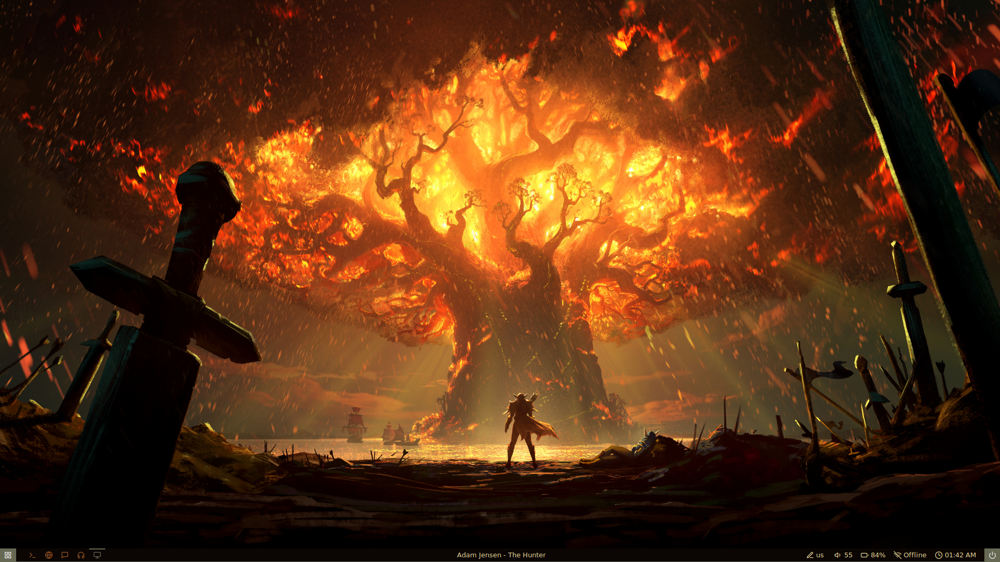

# Psyhich's dots
This is my OS configuration files. Install scripts in progres
# Qt
	For Qt themes I use Kvantum with imported themes. It can be set with qt5ct package
# GTK
	For setting GTK themes I use lxappearance and analogic theme as in Qt

# Preview

